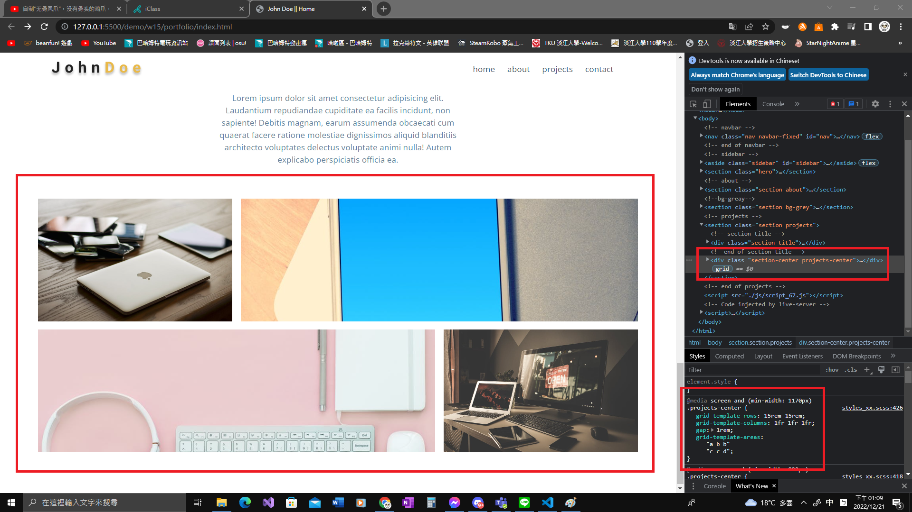

### Github and Vercel URL

[Github URL](https://github.com/Helson0110/1111-web-demo-410350267)

[Vercel URL](https://1111-web-demo-410350267-tfro.vercel.app/)

### w14-P1: file structures for final project


### w14-P2: social icons using global css, and custom css


### w14-P4: finish About section with responsive design with phone, and desktop computer


### w15-P1:nav link to about page with navbar and footer


### w15-P2: Latest works using grid-template-areas




### W15-logs: W15 all logs


```
$ git log --pretty=format:"%h%x09%an%x09%ad%x09%s" --after="2022-12-13"


$ git log --pretty=format:"%h%x09%an%x09%ad%x09%s" --after="2022-12-13"
996e6c3 Helson0110      Wed Dec 21 13:10:32 2022 +0800  ### w15-P2: Latest works using grid-template-areas
20a413a Helson0110      Wed Dec 14 15:09:21 2022 +0800  ### w15-P1:nav link to about page with navbar and footer
```


### w16-P1: show how to show odd number timeline
 


### w16-P2:connect section using clip-path
 


### W16-logs: W16 all logs


```
$ git log --pretty=format:"%h%x09%an%x09%ad%x09%s" --after="2022-12-20"
b6b92cf Helson0110      Thu Dec 22 22:38:13 2022 +0800  ### w16-P2:connect section using clip-path~
0736683 Helson0110      Wed Dec 21 14:52:09 2022 +0800  ### w16-P2:connect section using clip-path~
9f96ac4 Helson0110      Wed Dec 21 14:02:30 2022 +0800  ### w16-P1: show how to show odd number timeline
996e6c3 Helson0110      Wed Dec 21 13:10:32 2022 +0800  ### w15-P2: Latest works using grid-template-areas
```