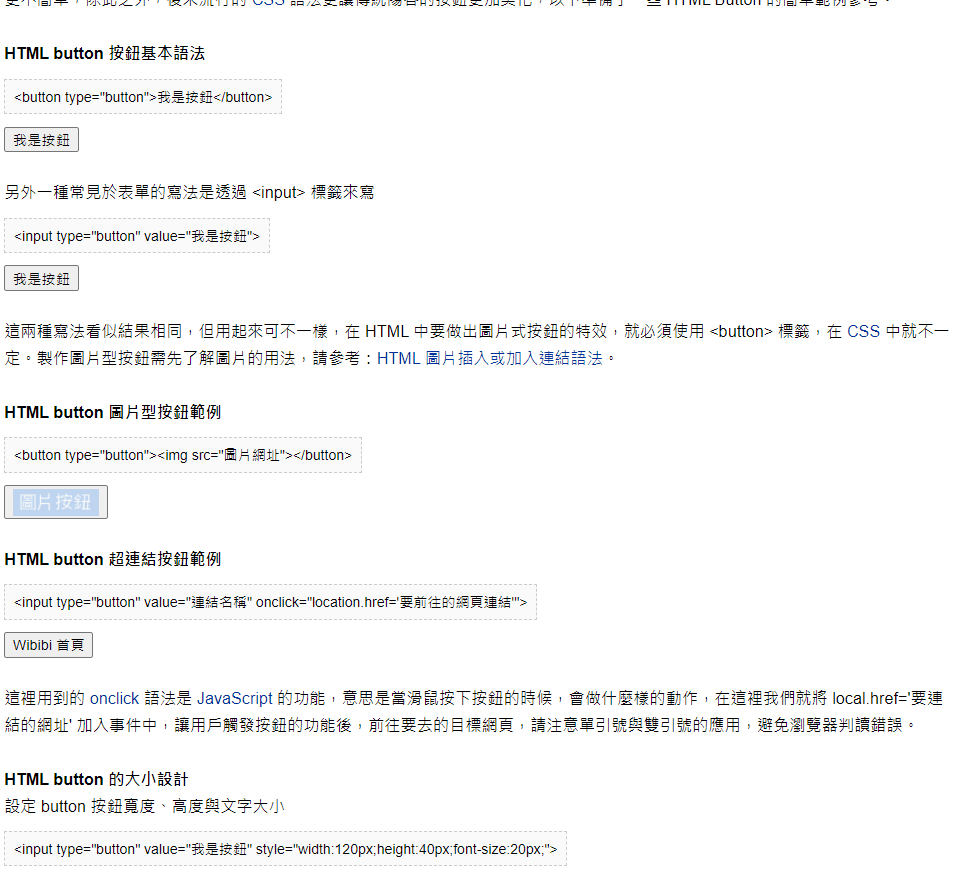
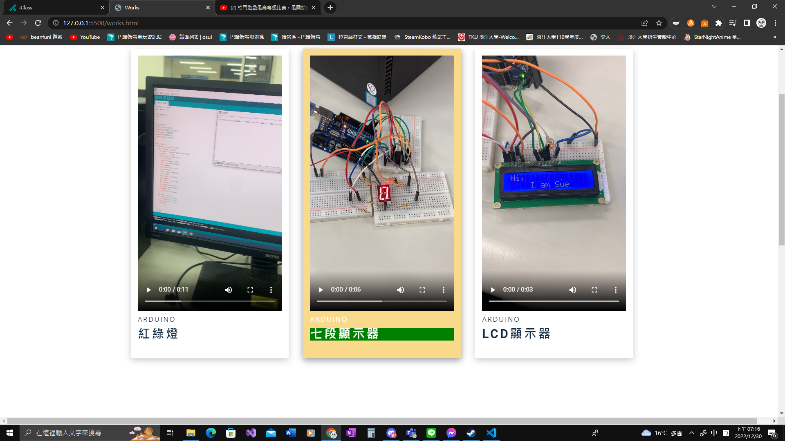
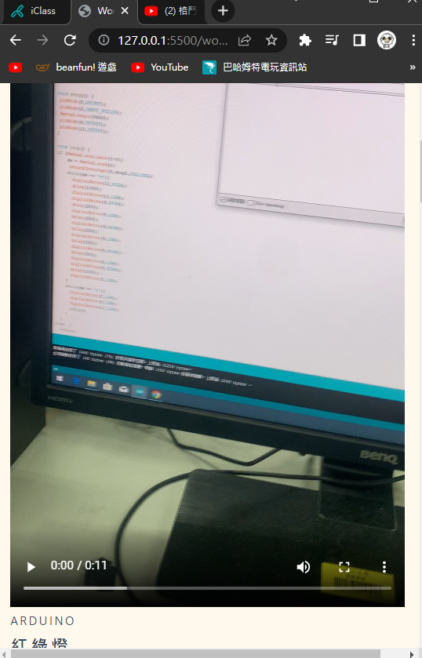
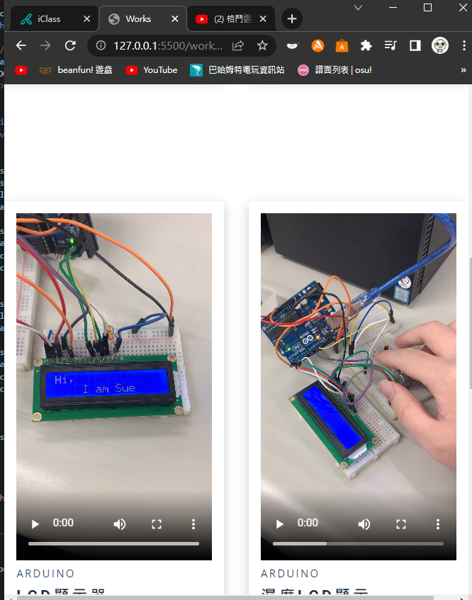
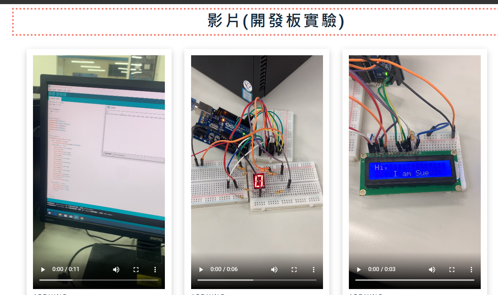

### Github and Vercel URL

[Github URL](https://github.com/Helson0110/1111-web-demo-410350267)

[Vercel URL](https://1111-web-demo-410350267-tfro.vercel.app/)

### 問題解決:
 按鈕:不會使用，於是GOOGLE找尋JAVA的寫法

https://www.wibibi.com/info.php?tid=117
### 自主學習:
指標底色:忘記如何指標上去調底色強調區塊

響應式網頁:製作兩到三種網頁呈現方式

### 學習心得:

##### 這學期選這門課受益良多，學到了很多有關HTML和CSS的相關知識，為自己儲備了一項新技能，雖然說是程式，但寫出來的東西，立馬就表現出來，非常直觀，學習容易，但如果要更進階的東西，必須動用到很多的JAVA去做撰寫，在這之前其實都還算基礎，這門課其實算是一些基礎解說，為有興趣的人日後自己學習能夠比較得心應手。