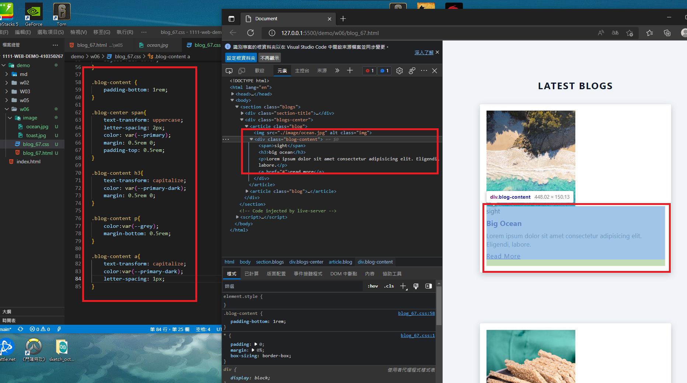
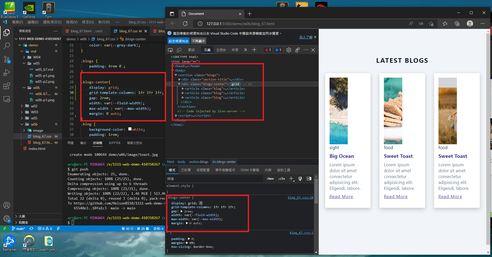
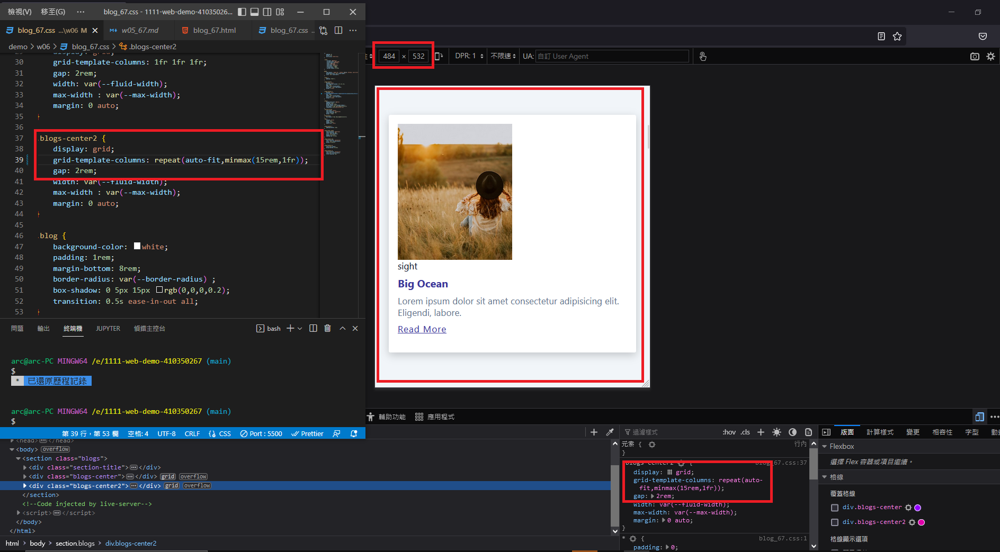
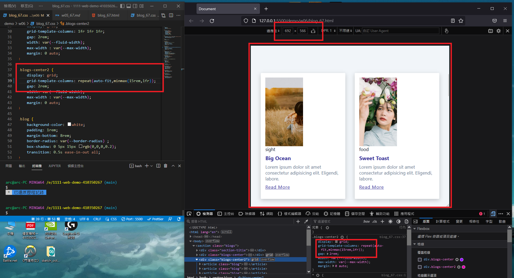
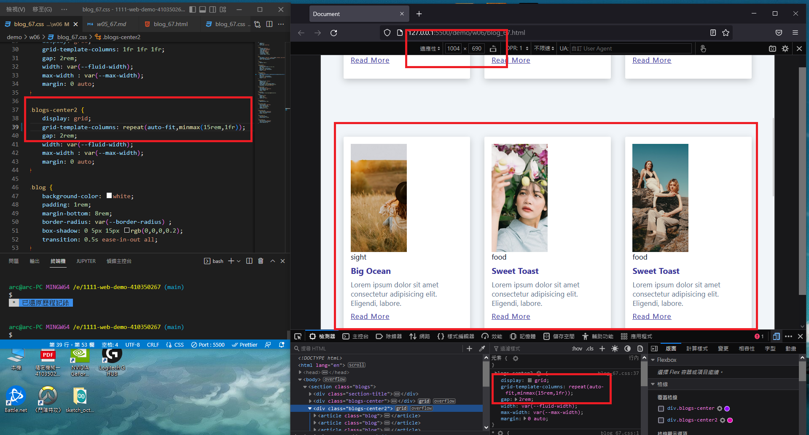
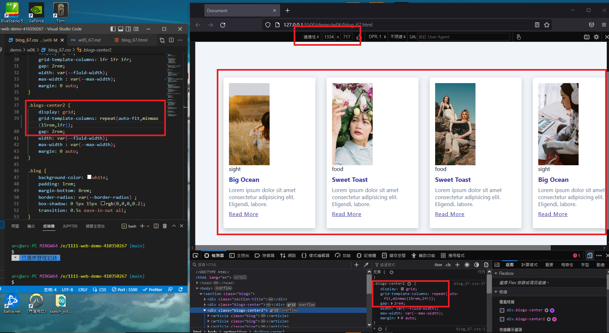

###  Github and Vercel URL
  
  
[Github URL](https://github.com/Helson0110/1111-web-demo-410350267 )
  
[Vercel URL](https://1111-web-demo-410350267-tfro.vercel.app/ )
  
###  w06-p1: Add blog content with css
  
  

  
###  w06-P2: use css grid to show 3 blogs
  
  

  
###  w06-P3: use css grid (minmax) to show 9 blogs
  
  




  
###  W06-logs: W6 all logs
  
  
```
$ git log --pretty=format:"%h%x09%an%x09%ad%x09%s" --after="2022-10-04"
94486de Helson0110      Wed Oct 12 15:15:41 2022 +0800  demo
fbc6c06 Helson0110      Wed Oct 12 15:07:54 2022 +0800  demo
10fa1c3 Helson0110      Wed Oct 12 14:23:09 2022 +0800  demo
65540e3 Helson0110      Wed Oct 5 15:00:56 2022 +0800   demo
2dbb76f Helson0110      Wed Oct 5 14:11:48 2022 +0800   demo
```
  