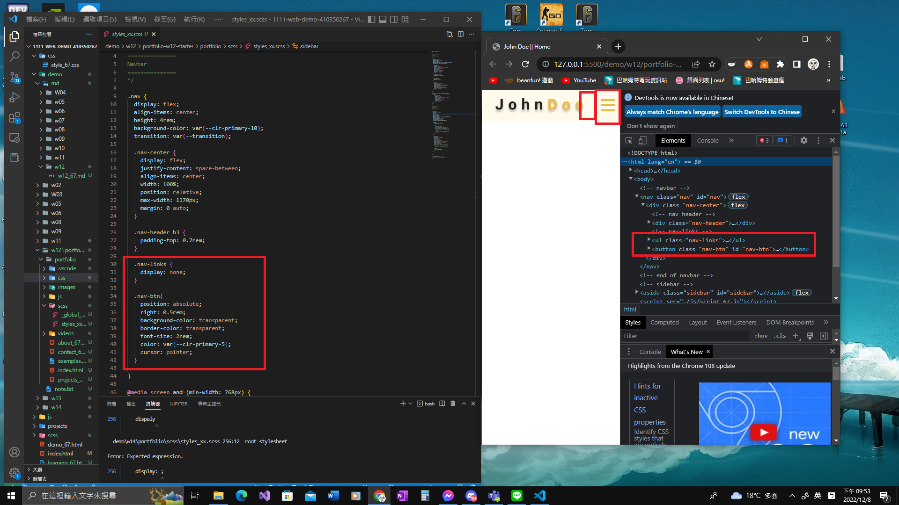
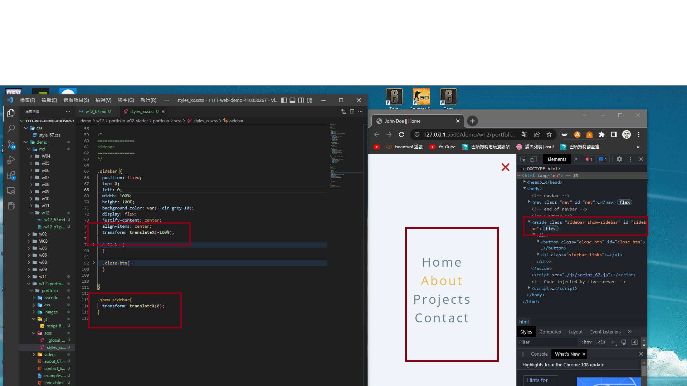
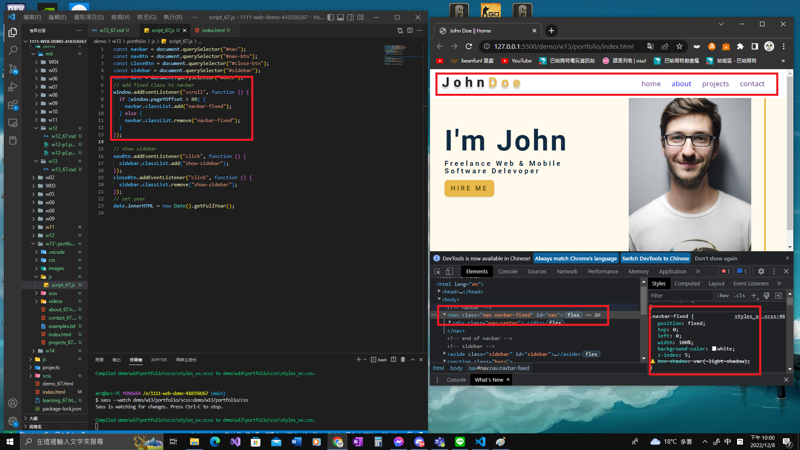
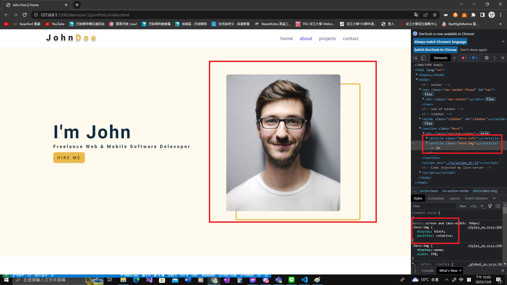
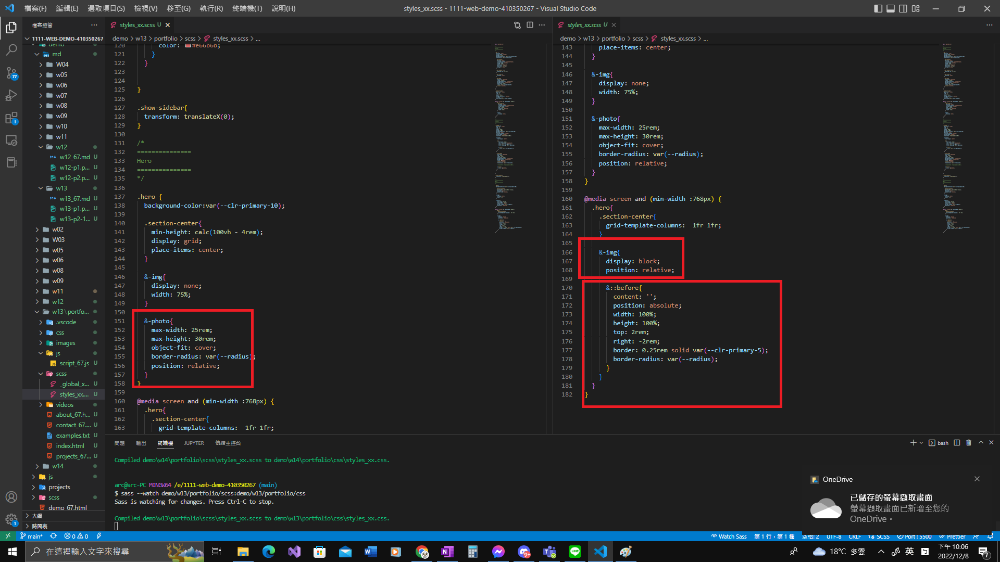
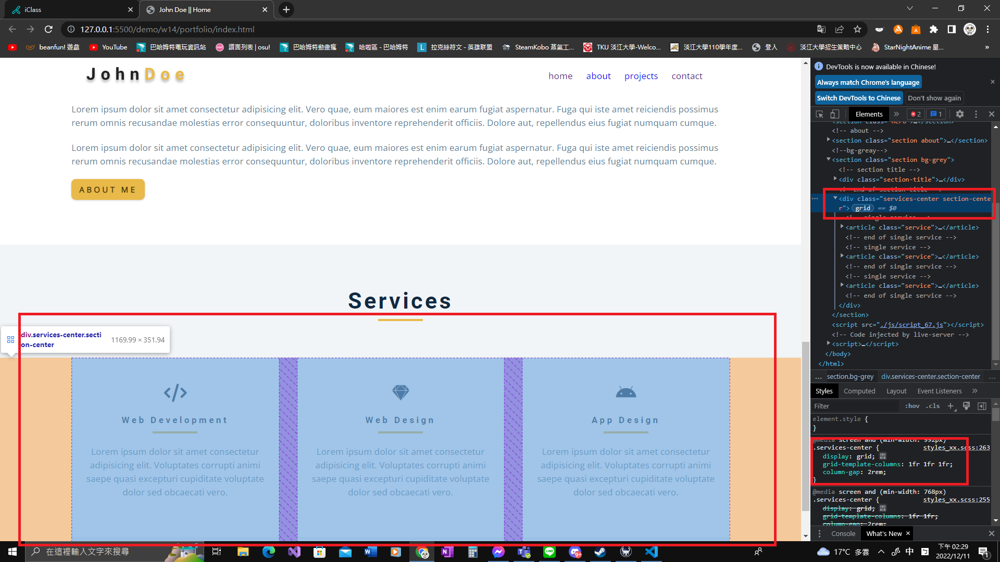
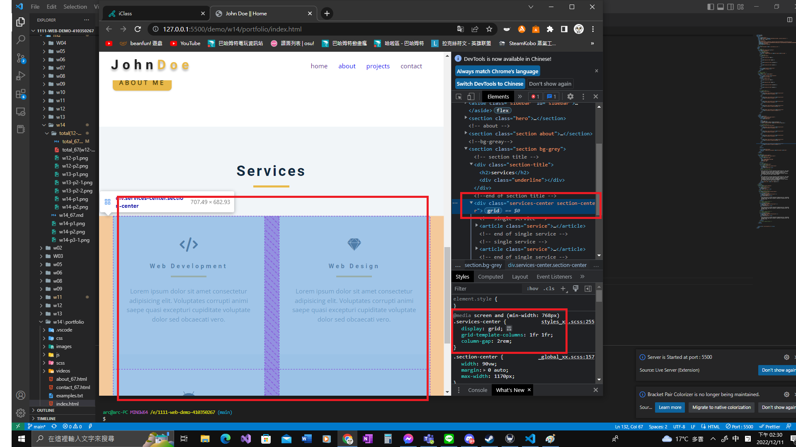
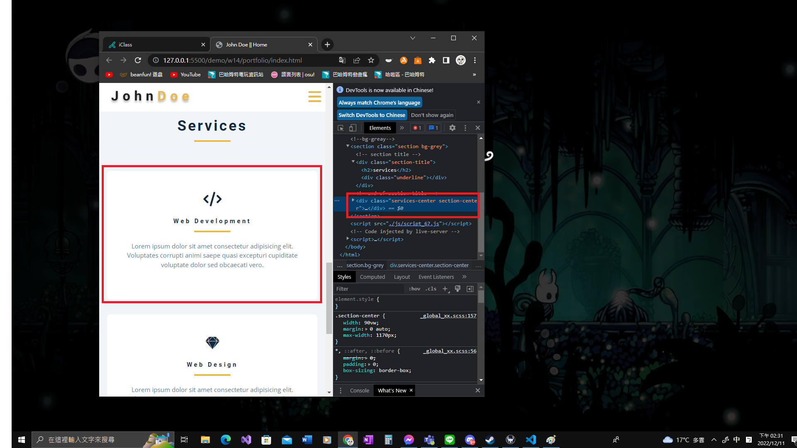

### Github and Vercel URL

[Github URL](https://github.com/Helson0110/1111-web-demo-410350267)

[Vercel URL](https://1111-web-demo-410350267-tfro.vercel.app/)

### w12-P1: create nav btn, nav links display none

### w12-P2: nav-btn and close-btn works

### w13-P1: show fixed navbar with js and css

### w13-P2: hero-img in section hero

### w14-P1: file structures for final project

### w14-P2: social icons using global css, and custom css

### w14-P3: Services section with responsive design with phone, pad and desktop computer

