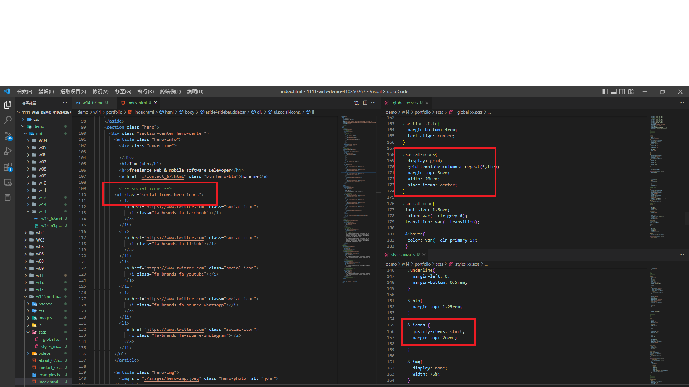
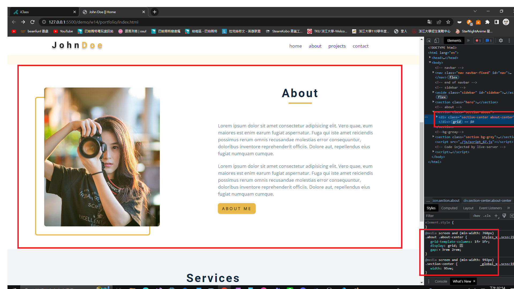

### Github and Vercel URL

[Github URL](https://github.com/Helson0110/1111-web-demo-410350267)

[Vercel URL](https://1111-web-demo-410350267-tfro.vercel.app/)

### w12-P1: create nav btn, nav links display none


### w12-P2: nav-btn and close-btn works


### w13-P1: show fixed navbar with js and css


### w13-P2: hero-img in section hero


### w14-P1: file structures for final project


### w14-P2: social icons using global css, and custom css



### w14-P3: Services section with responsive design with phone, pad and desktop computer


### w14-P4: finish About section with responsive design with phone, and desktop computer




```
$ git log --pretty=format:"%h%x09%an%x09%ad%x09%s" --after="2022-12-06"
8e8404a Helson0110      Sun Dec 11 14:57:55 2022 +0800  ### w14-P3: Services section with responsive design with phone, pad and desktop computer
3c0195c Helson0110      Sun Dec 11 14:56:40 2022 +0800  ### w14-P4: finish About section with responsive design with phone, and desktop computer
af97b43 Helson0110      Thu Dec 8 22:23:12 2022 +0800   PDF
87d0be4 Helson0110      Thu Dec 8 22:21:46 2022 +0800   md
d81b86a Helson0110      Thu Dec 8 22:16:58 2022 +0800   ### w14-P2: social icons using global css, and custom css
```
