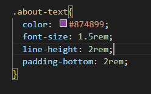
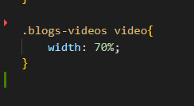
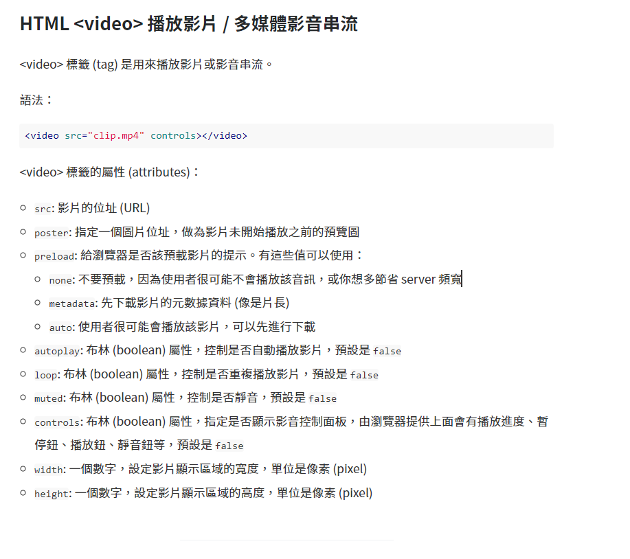
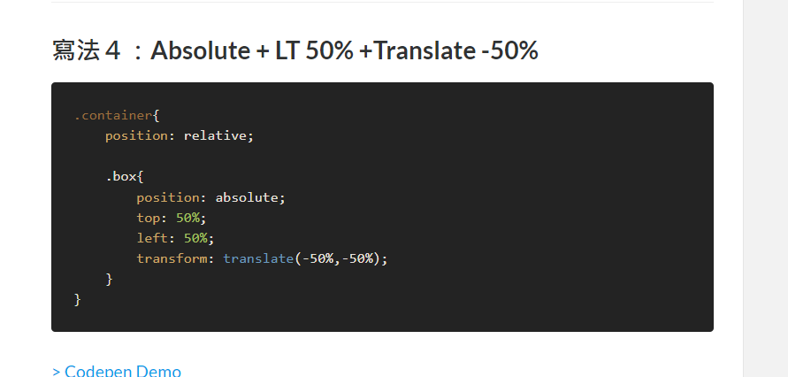

### Github and Vercel URL

[Github URL](https://github.com/Helson0110/1111-web-demo-410350267)

[Vercel URL](https://1111-web-demo-410350267-tfro.vercel.app/)

### 問題解決 : 字相互交錯/區塊大小不符合

字變大的時候，發現上下行的字相互交錯，查找資料，使用 line-height 指令使行距調高。

雖然區塊會隨著視窗大小而改變其位置，但影片仍就超出白框的範圍，於是修改了影片大小，修改到能與區塊大小相合。

### 自主學習 : 放影片/文字置中指令

未學習過如何擺放影片上去，於是去 google 查找此指令及使用方式。

不知道如何使文字如何置中，於是去 google 找指令，並使用此部落格中的方法 4 進行置中

### 學習心得

我覺得這門課會讓我學到很多東西，對於未來也很有幫助，可以說是多了一項很棒的技能。雖然說乍看之下指令繁多，但很多都是重複的並且具有規律性，學習起來不會很複雜 ，再者，如果有某些指令忘掉了，或是想到一些表現方法，但是卻不知道該用什麼方式去做編成，在網上，都會有很多教學或者設置指令的方式，非常好去學習，這個也不會像其他程式語言一樣，更多的是表現型的指令，較為淺顯易懂，對於初學者或者想試試看編成的人，也是很好的學習工具!

言而總之，這門學科使我受益良多，相信未來我可以創作出更多屬於我自己的部落格。
